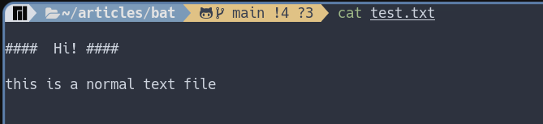
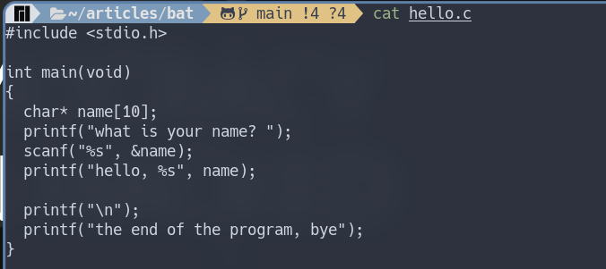
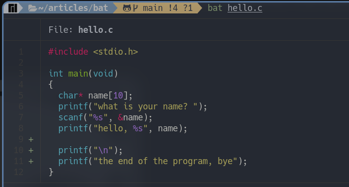
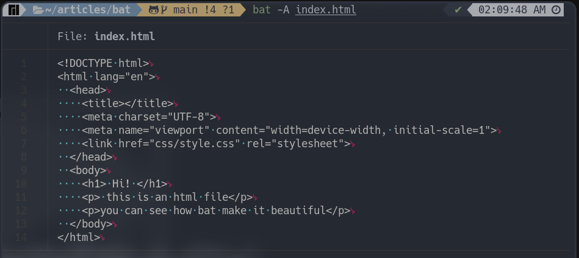

اداه bat هي اداه لعرض الملفات النصيه بداخل الطرفيه   
للوهله الاولي قد تعتقد انها مجرد اداه مماثله لاداه cat  التي تحدثنا  عنها في [هذا المقال](https://discourse.aosus.org/t/topic/2508) والذي انصحك بالاطلاع عليه اذا كنت لاتعلم عن اداه cat من الاساس  

اذن ما هو الاختلاف بين اداه bat واداه cat وهل اداه bat تستحق التجربه هذا السؤال الذي سوف تجاوبه علي نفسك  في  نهايه المقال باذن الله  تعالي  

اداه bat هي نسخه مطوره من اداه cat, كما انه تمت كتابه الاداه بلغه  ``Rust`` و تعد الاداه الاكثر  قابليه لاستبدال cat من بين امثالها

> يمكنك تجاهل اي كود برمجي مكتوب في هذه المقاله ولن يؤثر ذلك علي فهمك للاداه وما تقدمه وكيفيه الاستفاده منها باذن الله تعالي 

### نظره سريعه علي ما تقدمه  الاداه 

* تجربه  الاداه  علي ملف بامتداد ```txt```


* تجربه الاداه علي ملف يحتوي علي كود مكتوب بلغه سي


> يمكنك من خلال المثالين السابقين ان تلاحظ الفرق الكبير بين اداه cat و اداه اليوم




### اهداف  الاداه 
* عرض الجمل التي بداخل الملف بشكل ملون وجميل ومنظم ومتقدم
* تكامل مع Git لاظهار التعديلات التي تمت 
* تهدف الاداه لان تكون بديلا عن اداه cat
* و توفير واجه استخدام سهله وجميله للمستخدم لعرض الملفات بداخل الطرفيه

> يمكنك الانتقال الي جزء تثبيت الاداه [من هنا](#تثبيت-الاداه-علي-بعض-التوزيعات-المختلفه)  اذا اعجبتك الاداه واردت ان تقوم بتجربه الاوامر القادمه

### شرح مميزات الاداه

#### عرض الجمل بشكل ملون و منظم

تتعرف اداه `` bat `` علي الكثير من انواع الملفات النصيه وتعرضها بشكل سهل علي القارئ

* لذلك اذا كان هناك ملف نصي فسوف يتم عرضه بشكله الطبيعي كالتالي


يمكنك ان تلاحظ عدم وجود شئ مميز في هذا النوع من الملفات كما هو متوقع من الملفات النصيه ذات تنسيق ```txt```

* لكن ماذا عن عرض ملف من نوع ```html```  


يمكنك بالطبع ملاحظه الاختلاف الكبير حيث ان الاداه قامت بتسهيل عمليه التعرف علي مكونات ومحتوي الملف بشكل واضح ومميز

* مثال اخر علي ملف بامتداد ```c``` 


لاحظ وجود اكثر من لون فاللون الاحمر له دلاله معينه وكذلك اللون الازرق النيلي, قامت الاداه باستخدامه لتمثيل عبارات برمجيه معينه فقط وكذلك اللون الاصفر والبنفسجي وهكذا 

يمكنك ان تلاحظ الفرق الكبير والفائده التي يمكن ان تعود عليك من استخدام مثل هذه الاداه لذلك فان الاداه عمليه بشكل كبير خاصه لمن يعمل بمجال البرمجه  

#### التكامل مع ```Git``` 

> اذا لم تكن تعلم ما هو Git فيمكنك البحث عنه لفهم الميزه التي تقدمها الاداه 

تقدم اداه ```bat``` تكامل مع ```Git``` حيث انها تمكن المستخدم من معرفه التغيرات التي حدثت للملف بشكل سهل 


هذا نفس الملف من المثال السابق ولكن قمت بالتعديل عليه
يمكنك ان تلاحظ  ظهورعلامات جديده بجانب ارقام الاسطر وهذه العلامات  تدل علي نوع التغير الذي حدث في هذا السطر 

``` - ``` تدل هذه العلامه علي حدوث عمليه حذف لمحتوي في الملف النصي 

لذلك بالفعل يمكنك ان تلاحظ ان السطر الاول من الملف تم حذفه 

``` ~ ``` تدل حدوث تعديل في هذا السطر 

``` + ``` تدل علي اضافه سطر او محتوي جديد لم يكن موجودا من قبل



#### اظهار العناصر الغير قابله للطباعه```-A```

العناصر الغير قابله للطباعه هي عناصر تستخدم لاضافه تنسيق معين للنص ومنها 
* المسافه البيضاء ``` white space ```
* المسافه البادئه ``` tab ```
* اضافه سطر جديد ``` Enter ```

يمكنك استخدام هذه الميزه عن طريق كتابه خيار ```-A``` 

```bash
[x-user@arch]$ bat -A index.html
```



يبدو ان هناك بعض التغيرات التي قد حدثت عند استخدام هذا  الخيار ولكن لنركز مبدأيا علي الغرض الاساسي من هذا الخيار وهو عرض  العناصر الغير مطبوعه وسوف نلاحظ انه قام بطباعه نقط زرقاء كدليل علي المسافه وفي نهايه كل سطر يوجد حرفان هما ال ```l``` , ```f``` والذان يرمزان لسطر جديد في هذا الملف

التغير الثاني الذي قد حدث وهو اختفاء الالوان من النص وذلك لانك قمت بالتركيز علي العناصر الغير مطبوعه عند استخدام هذا الخيار لذلك فان الاداه لن تشتتك بالعناصر الاخري وسوف تقوم بجذب انتباه عينيك علي العناصر التي قمت بتحديدها انت

##### قيام ```bat``` بكل ما تقوم به ```cat```
حسنا الان وبعد ان تعرفنا علي الاداه هل يمكن لاداه ```bat``` ان تقوم بكل العمليات السابقه التي قمنا بها عند شرح اداه ```cat``` في هذا المقال

الاجابه:   هي نعم وبكل تاكيد ويمكنك ان تقوم بتجربه الامر بنفسك للتاكد  منه

كما انه كل ما يمكن لاداه ```cat``` يمكن لاداه ```bat``` ان تقوم به ايضا لذلك هي الاداه التي يمكنها استبدال ```cat``` 


### تثبيت الاداه علي بعض التوزيعات المختلفه

> قبل محاوله تثبيت الاداه وجب علي التنبيه الي ان هذه الاداه توجد علي بعض التوزيعات باسم ```bat``` وايضا باسم ```batcat```

لتثبيت الاداه كل ما عليك فعله هو ايجاد التوزيعه الخاصه بك من التوزيعات المدرجه وكتابه او نسخ الامر الذي ياتي بعد علامه ```$```

يمكنك ايضا استخدام هذه الاداه ايضا اذا كنت تستعمل نظام تشغيل ```windows``` ولكني لن  اتطرق لشرح الطريقه  في هذا المقال للاسف ولكن يمكنك النظر في جزء المراجع وستجد ما يفيدك باذن الله


```bash
# Arch Linux 
$ sudo pacman -S bat
```
```bash
# Apline Linux 
$ sudo apk add bat
```
```bash
# Fedora Linux 
$ sudo dnf install bat
```
```bash
# Gentto Linux 
$ sudo emerge sys-apps/bat
```
```bash
# Funtoo Linux 
$ sudo emerge sys-apps/bat
```
```bash
# FreeBSD Linux 
$ sudo pkg install bat
```
```bash
# Termux Linux 
$ pkg install bat
```
```bash
# Void Linux 
$ xbps-innstall -S bat
```
```bash
# openSUSE Linux 
$ zypper install bat
```


#### اذا اردت استخدامها بشكل اساسي بدلا من اداه cat يمكنك اضافتها ك alias 

حسنا هذا الترشيح للاشخاص الذين اعجبتهم الاداه ويريدون استخدامها ولكن يريدون ايضا ان يظل اسم الامر كما هو ```cat```

بالطبع يمكنك ذلك عن طريق اضافه كنيه ```alias``` لملف الصدفيه الخاص والذي اغلب الظن سيكون اما

* ```~/.bashrc```
* ```~/.zshrc```

```bash
alias cat='bat'
```

وفي النهايه اشكرك علي قراء المقال واسئل الله ان يكون قد اوضح الاداه بشكل واضح وبعض الطرق لاستخدامها

سائلا الله تعالي ان ينفعنا بما علمنا 

وانتظر ارائكم واقتراحاتكم عن المقال باذن الله

### المصادر

[صفحه دليل الاداه علي Git](https://github.com/sharkdp/bat#how-to-use)

### ترخيص
هذا الموضوع يتبع ترخيص جميع مواضيع أسس هو CC-BY-SA 4.0
