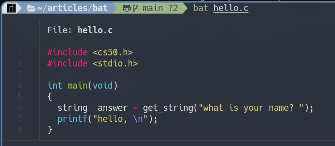
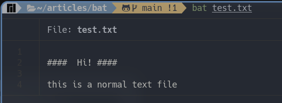
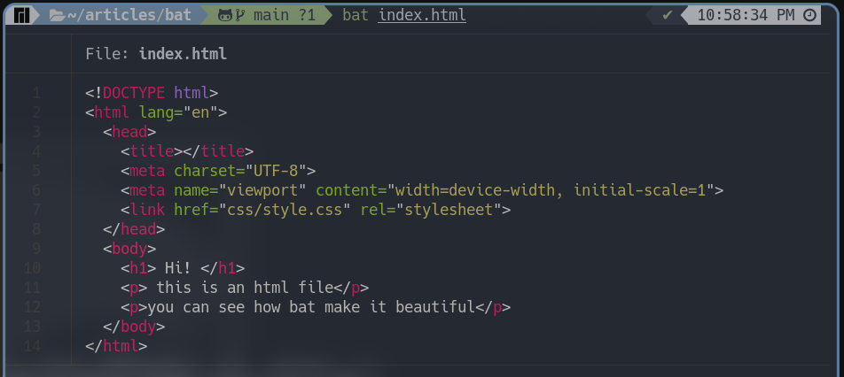
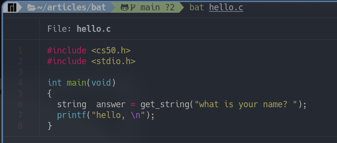
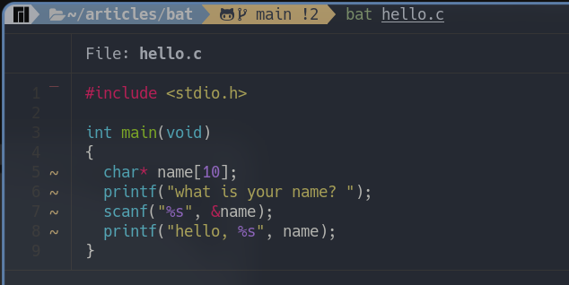

اداه bat هي اداه لعرض الملفات النصيه بداخل الطرفيه   
للوهله الاولي قد تعتقد انها مجرد اداه مماثله لاداه cat  التي تحدثنا  عنها في هذا المقال والذي انصحك بالاطلاع عليه اذا كنت لاتعلم عن اداه cat من الاساس  

اذن ما هو الاختلاف بين اداه bat واداه cat وهل اداه bat تستحق التجربه هذا السؤال الذي سوف تجاوبه علي نفسك  في  نهايه المقال باذن الله  تعالي  

اداه bat هي نسخه مطوره من اداه cat, كما انه تمت كتابه الاداه بلغه  ``Rust`` و تعد الاداه الاكثر  قابليه لاستبدال cat من بين امثالها

### نظره سريعه علي ما تقدمه  الاداه 

* تجربه  الاداه  علي ملف بامتداد ```txt```


* تجربه الاداه علي ملف يحتوي علي كود مكتوب بلغه سي



> يمكنك من خلال المثالين السابقين ان تلاحظ الفرق الكبير بين اداه cat و اداه اليوم

### اهداف  الاداه 
* عرض الجمل التي بداخل الملف بشكل ملون وجميل ومنظم ومتقدم
* تكامل مع Git لاظهار التعديلات التي تمت 
* تهدف الاداه لان تكون بديلا عن اداه cat
* و توفير واجه استخدام سهله وجميله للمستخدم لعرض الملفات بداخل الطرفيه

> يمكنك الانتقال الي جزء تثبيت الاداه [من هنا](#تثبيت-الاداه-علي-انظمه-التشغيل)  اذا اعجبتك الاداه واردت ان تقوم بتجربه الاوامر القادمه

### شرح مميزات الاداه

#### عرض الجمل بشكل ملون و منظم

تتعرف اداه `` bat `` علي الكثير من انواع الملفات النصيه وتعرضها بشكل سهل علي القارئ

* لذلك اذا كان هناك ملف نصي فسوف يتم عرضه بشكله الطبيعي كالتالي



يمكنك ان تلاحظ عدم وجود شئ مميز في هذا النوع من الملفات كما هو متوقع من الملفات النصيه ذات تنسيق ```txt```

* لكن ماذا عن عرض ملف من نوع ```html```  



يمكنك بالطبع ملاحظه الاختلاف الكبير حيث ان الاداه قامت بتسهيل عمليه التعرف علي مكونات ومحتوي الملف بشكل واضح ومميز

* مثال اخر علي ملف بامتداد ```c``` 



لاحظ وجود اكثر من لون فاللون الاحمر له دلاله معينه وكذلك اللون الازرق النيلي, قامت الاداه باستخدامه لتمثيل عبارات برمجيه معينه فقط وكذلك اللون الاصفر والبنفسجي وهكذا 

يمكنك ان تلاحظ الفرق الكبير والفائده التي يمكن ان تعود عليك من استخدام مثل هذه الاداه لذلك فان الاداه عمليه بشكل كبير خاصه لمن يعمل بمجال البرمجه  

#### التكامل مع ```Git``` 

تقدم اداه ```bat``` تكامل مع ```Git``` حيث انها تمكن المستخدم من معرفه التغيرات التي حدثت للملف بشكل سهل 




### تثبيت الاداه علي انظمه التشغيل 

#### اذا اردت استخدامها بشكل اساسي بدلا من اداه cat يمكنك اضافتها ك alias 

