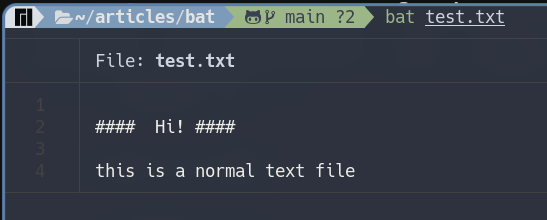

اداه bat هي اداه لعرض الملفات النصيه بداخل الطرفيه   
للوهله الاولي قد تعتقد انها مجرد اداه مماثله لاداه cat  التي تحدثنا  عنها في هذا المقال والذي انصحك بالاطلاع عليه اذا كنت لاتعلم عن اداه cat من الاساس  

اذن ما هو الاختلاف بين اداه bat واداه cat وهل اداه bat تستحق التجربه هذا السؤال الذي سوف تجاوبه علي نفسك  في  نهايه المقال باذن الله  تعالي  

اداه bat هي نسخه مطوره من اداه cat, كما انه تمت كتابه الاداه بلغه  ``Rust`` و تعد الاداه الاكثر  قابليه لاستبدال cat من بين امثالها

### نظره سريعه علي ما تقدمه  الاداه 

* تجربه  الاداه  علي ملف بامتداد ```txt```



* تجربه الاداه علي ملف يحتوي علي كود مكتوب بلغه سي


> يمكنك من خلال المثالين السابقين ان تلاحظ الفرق الكبير بين اداه cat و اداه اليوم

### اهداف  الاداه 
* عرض الجمل التي بداخل الملف بشكل ملون وجميل ومنظم ومتقدم
* تكامل مع Git لاظهار التعديلات التي تمت 
* تهدف الاداه لان تكون بديلا عن اداه cat
* و توفير واجه استخدام سهله وجميله للمستخدم لعرض الملفات بداخل الطرفيه

> يمكنك الانتقال الي جزء تثبيت الاداه [من هنا](#تثبيت-الاداه-علي-انظمه-التشغيل)  اذا اعجبتك الاداه واردت ان تقوم بتجربه الاوامر القادمه

### شرح مميزات الاداه


### تثبيت الاداه علي انظمه التشغيل 

#### اذا اردت استخدامها بشكل اساسي بدلا من اداه cat يمكنك اضافتها ك alias 

