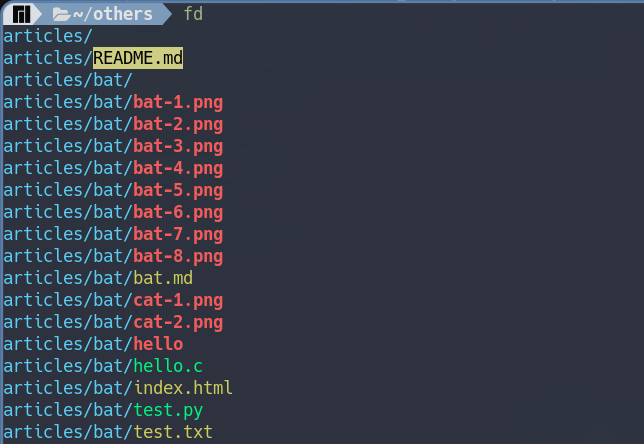
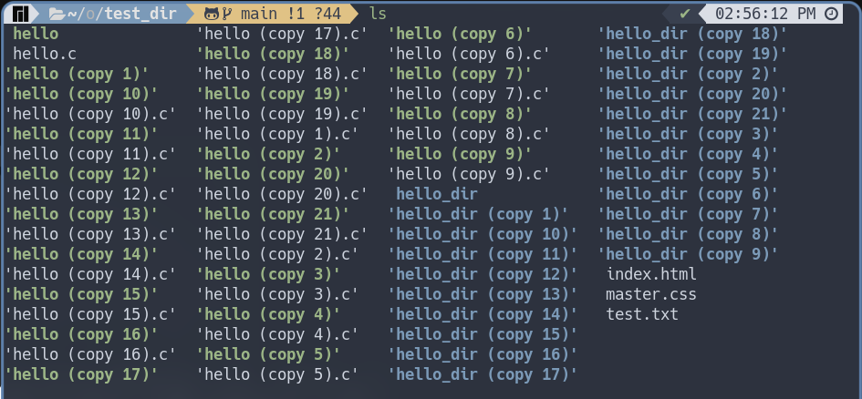
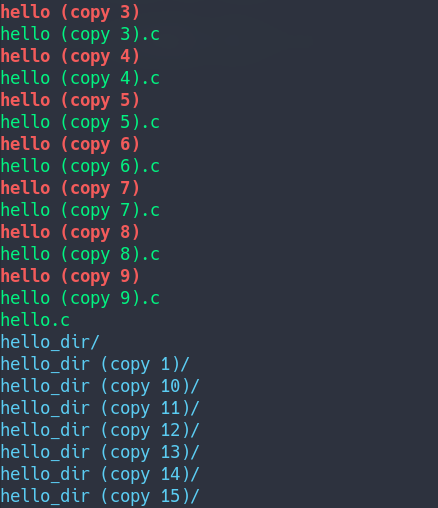
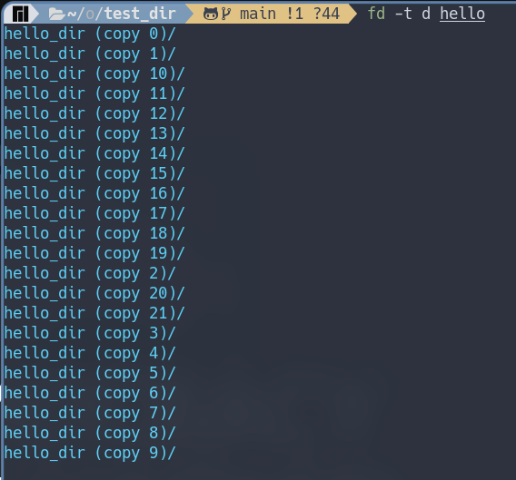
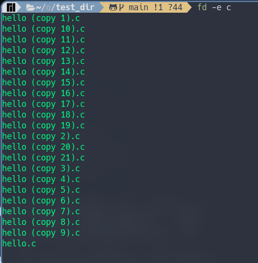
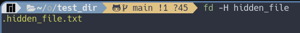

# مقدمه
بما انك تقرا هذا المقال فذلك يعني انك تستخدم جهاز الكتروني اما حاسوب او جوال او غيره من الاجهزه الالكترونيه  
وبما انك تستعمل الاجهزه الالكترونيه فذلك يعني انك تتعامل ايضا مع الملفات والمجلدات 

وعند ذكر الملفات والمجلدات فذلك يعني انك بالتاكيد قد حدث وانك 
تذكرت شيئا مهما وذلك الشئ موجود اما في مجلد ما او في ملف ما علي جهازك الاليكتروني 
لذلك ذهبت مسرعا لمحاوله ايجاده ولكن كما هو المعتاد لم تستطع ان تتذكر الاسم او اين كان هذا المجلد او الملف المهم

واذا كنت ممن يستخدمون نظام تشغيل ويندوز فستحاول البحث في النظام كاملا عن هذا الملف ولكن للاسف في ويندوز وباستخدام مدير الملفات الخاص بهم سيكون الامر بطئ جدا وقد تعتقد ان عمليه البحث قد باءت بالفشل  

واذا كنت ممكن يستخدمون نظام تشغيل لينكس فالبتاكيد ستحاول البحث عن طريقه لايجاد الملفات والمجلدات و سيكون من حسن حظك ان تجد مثل هذا المقال عن امر [find](https://discourse.aosus.org/t/topic/2411) 
والذي سيكون مساعدا جدا لك في ايجاد ما تريد ولكن قد تشعر بعدم الراحه في كتابه امر [find](https://discourse.aosus.org/t/topic/2411) لانه قد يكون طويلا بعض الشئ بل وقد يمكن ان تشعر في بدايه استخدامك لهذا الامر انه معقد قليلا وقد تريد اداه تريك المخرجات بشكل ملون 

لذلك في مقال اليوم ساحاول ان اريك اداه جديده وجميله للبحث في نظام لينكس وهي اداه `` fd ``

## التعريف عن اداه ```fd```

اداه ```fd```هي اداه لايجاد الملفات او المجلدات بشكل سريع وبسيط كما انها تعد اداه  سهله الفهم والاستخدام بالنسبه للمستخدم

هدف الاداه ليس ان تقوم بكل ما يقوم به امر [find](https://discourse.aosus.org/t/topic/2411) الا انها توفر الوظائف الشائعه للمستخدمين بشكل سلس وانيق 

## نظره سريعه علي الاداه 
حتي نستعرض الاداه بشكل مختصر سنقوم فقط بكتابه امر الاداه ومقارنتها مع امر [find](https://discourse.aosus.org/t/topic/2411)

- تجربه امر اداه fd



يمكننا ان نلاحظ ان المخرج اصبح ملونا والذي يجعل من السهل التعرف والتفريق بين انواع الملفات والمجلدات كما ان المخرج اصبح مرتبا ترتيبا ابجديا ورقميا

> يمكنك ان تجعل المخرج بدون الوان عن طريق اضافه كنيه لملف الطرفيه الخاص بك   
```shell
alias fd='fd --color=never'
```
- تجربه امر [find](https://discourse.aosus.org/t/topic/2411)


علي عكس اداه  ``fd`` المخرج غير مرتب ابجديا او رقميا حتي وسنفسر ذلك باذن الله ولكن للعلم يمكن ان تقوم بجعل امر [find](samir_link) يرتب المخرج عن طريق كتابه لاحقه 

## مميزات الاداه

- طريقه كتابه الامر سهله وبديهيه
- الاداه تدعم ال ```Regular expression``` وايضا ```glob-based patterns```
- الاداه سريعه مقارنه باداه [find](https://discourse.aosus.org/t/topic/2411) 
- مخرج الاداه يكون ملونا بالوان تساعد المستخدم وتوضح نوع الملف
- في حاله البحث الافتراضيه تقوم الاداه بالبحث بدون وضع حاله الاحرف في الحسبان وتضع الاداه حاله الاحرف في الحسبان اذا كانت كلمه البحث تحتوي علي احرف كبيره 
- الاداه تتجاهل الملفات المخفيه في الوضع الافتراضي للبحث
- كما تتجاهل الاداه ايضا الملفات التي يتم تجاهلها في ملف ```.gitignore``` في وضع البحث الافتراضي


## شرح الاداه

حسنا اولا لنذهب مباشره لحل المشكله التي تواجهنا وهي محاوله البحث عن الملفات او المجلدات وكيف يمكننا ان نقوم بذلك مع اداه اليوم 

1. البحث عن ملف او مجلد يوجد اسفل مجلد العمل الحالي
```shell
[foo@baz]$ fd [ اسم الملف او المجلد الذي تريد البحث عنه]
```


قمنا بالبحث عن ملف يسمي ```hello.c``` وبالفعل قامت الاداه بايجاد الملف لنا وقامت بعرض المسار الذي يوجد به هذا الملف 
 
ولا يكون هناك اختلاف اذا كنا نريد البحث عن مجلد 


2. البحث عن ملف او مجلديوجد داخل مسار معين 

```shell
[foo@baz]$ fd [ اسم الملف او المجلد ] [ المسار الذي تريد البحث بداخله ]
```


قامت الاداه بالبحث عن اسم الملف بدايه من هذا المسار حتي وجدته وعرضت المسار الذي يوجد به هذا الملف

في جميع عمليات البحث السابقه لم نقم بحديد نوع الملف الذي نقوم بالبحث عنه وهذه الطريقه لا تعد الطريقه الانسب للبحث وبالاخص اذا كان لديك الكثير والكثير من الملفات لذلك فان الاداه سوف تقوم بالبحث عن الاسم ولن تهتم بنوع الملف اي انها لن تهتم اذا كان نوع الملف مجلد او ملف نصي او برنامج او غيره  وفي الجزء القادم سنري المشكله وكيفيه حلها  


### البحث بشكل عام في لينكس

في لينكس يمكنك القيام بكل ما تريد به فعليا لذلك هناك طرق عديده لكيفيه البحث وقد تم ذكر بعض منها في مقال [find](https://discourse.aosus.org/t/topic/2411)  
فهناك من يريد البحث عن عن ملف عادي او برنامج او مجلد وغيرها من الانواع 

ولكن لننظر لهذا المثال البسيط والمشكله التي ستواجهنا به  

لنفترض ان لدينا ملف باسم ```hello.c``` ولدينا ايضا مجلد باسم ``hello`` وايضا لدينا برنامج باسم ``hello_dir``  
ويوجد العديد من هذه النسخ بداخل مجلد العمل الحالي 


 
ومن داخل هذا المجلد نريد البحث عن الملفات التي باسم  ``hello``  ولها امتداد ```c```

لذلك سنقوم بكتابه الامر التالي 

```shell
[foo@baz]$ fd hello
```
هذه الصوره هي مجرد جزء من المخرج لان المخرج طويل جدا



ولكننا سنجد ان المخرج كبير جدا كما ان الاداه لم تقوم بالمطلوب منها بشكل كامل 

قد يتساءل البعض لما نقول ان الاداه لم تقم بما نريده مع انها اظهرت كل الملفات التي باسم ``hello`` وايضا لها امتداد ``c``  

حسنا هذا صحيح ولكن الاداه قامت ايضا باظهار المجلدات وايضا البرامج التي تحتوي علي كلمه ``hello`` ولذلك نقول ان الاداه لم تقم بما نريده بشكل صحيح  

ولكن الخطا هنا يقع علي المستخدم حيث انه لم يقم بتحديد نوع الملف الذي يبحث عنه

لذلك فان من الافضل ان تحدد نوع ما تبحث عنه حتي توفر الوقت والجهد 

#### حسنا ولكن كيف يمكننا تحديد نوع ما نريد البحث عنه باستخدام هذه الاداه؟  &nbsp;  لاحقه ``t-``
يمكننا ذلك عن طريق استخدام لاحقه وهي ``t-`` 

وطريقه كتابه الامر كالتالي 
```shell
[foo@baz]$ fd -t [ النوع الذي تريد البحث عنه ] [ اسم الملف ] [ المسار الذي تريد البحث بداخله ]
```



وهذه هي كل الانواع التي تتيحها هذه الاداه

```shell
[possible values: f, file, d, directory, l, symlink, x, executable, e, empty, s, socket, p, pipe]
```


#### ولكن كيف يمكن ان اجعل هذه الاداه تقوم بالبحث فقط عن الملفات التي لها امتداد معين؟  &nbsp; لاحقه ``e-``

حسنا في هذا المثال يمكننا ان نقوم بالبحث عن الملفات التي قمنا بانشاءها والتي لها امتداد من نوع ``c``  وذلك عن طريق 

```shell
[foo@baz]$ fd -e [ النوع الذي تود البحث عنه ] [ المسار الذي تود البحث بداخله ]
```



#### البحث عن الملفات المخفيه باستخدام لاحقه ``H-`` او ```--hidden```

يمكننا ان نقوم بالبحث عن الملفات او المجلدات المخفيه باستخدام اداه اليوم ايضا وتكون طريقه الكتابه كالتالي 


```shell
[foo@baz]$ fd -H [ اسم الملف او المجلد الذي تريد البحث عنه ]
```



### تثبيت الاداه علي بعض التوزيعات المختلفه 
يمكنك أيضا استخدام هذه الأداة أيضا إذا كنت تستعمل نظام تشغيل `` windows `` او ``Mac  ``ولكني لن أتطرق لشرح الطريقة في هذا المقال للأسف ولكن يمكنك النظر في جزء المراجع وستجد ما يفيدك بإذن الله
```shell
# Arch Linux
sudo pacman -S fd
```
```shell
# Ubuntu Linux
sudo apt install fd-find
```
```shell
# Debian Linux
sudo apt-get install fd-find
```
```shell
# Fedora Linux
dnf install fd-find
```
```shell
# Alpine Linux
apk add fd
```
```shell
# Gentoo Linux
emerge -av fd
```
```shell
# openSUSE Linux
zypper in fd
```
```shell
# Void Linux
xbps-install -S fd
```

### وفي الختام
اتمني ان يكون الله قد وفقتي و شرح الاستخدامات الاساسيه للاداه والتي اعتقد انها افضل لمن يتعامل في بدايه الامر مع اوامر الطرفيه ولمن يريد فقط الاستخدامات البسيطه و لكن لمن يريد استخدامات اكثر تقدما والبحث بطرق معينه ومخصصه فاعتقد ان امر [find](https://discourse.aosus.org/t/topic/2411) هو الانسب له 


وفي النهاية أشكرك على قراء المقال وأسأل الله أن يكون قد أوضح الأداة بشكل واضح وبعض الطرق لاستخدامها

سائلاً الله تعالى أن ينفعنا بما علمنا

وانتظر آرائكم واقتراحاتكم عن المقال بإذن الله

### المصادر

[صفحة دليل الأداة علي Git](https://github.com/sharkdp/fd#command-execution)

### ترخيص

هذا الموضوع يتبع ترخيص جميع مواضيع أسس هو CC-BY-SA 4.0
