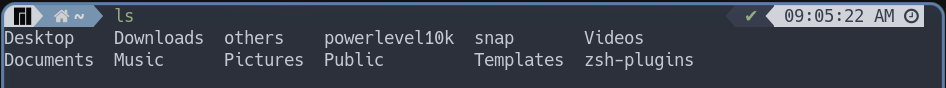
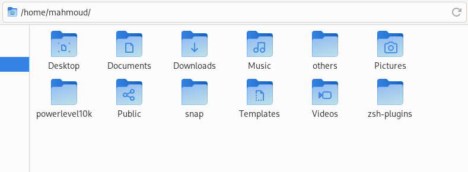
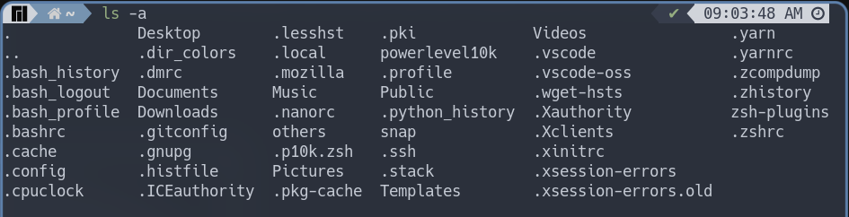
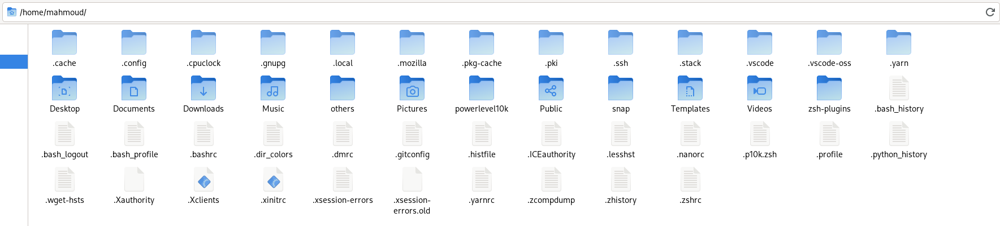
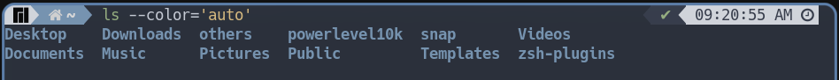
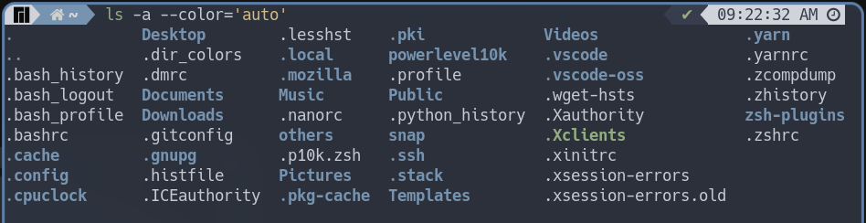
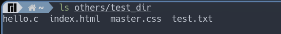
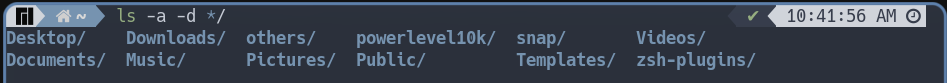
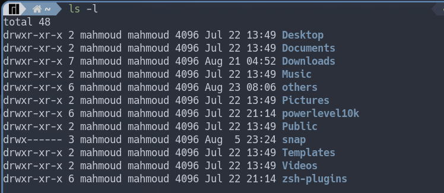
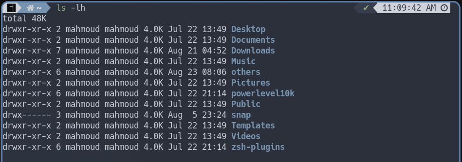

## مقدمه
يعد نظام لينكس هو النظام الافضل من حيث امكانيه التحكم وسهول الوصول
لانه يوفر للمستخدم العديد والعديد من الاوامر التي تقوم بنفس ما تقوم به
البرامج ذات الوجهات الرسوميه بل وحتي ان هذه الاوامر تختصر علي المستخدم الكثير
والكثير من الوقت فيمكن من خلال امر واحد بسيط القيام بعمليه معينه
ولكن اذا كنت تريد القيام بنفس الامر من خلال البرامج ذات الوجهات الرسوميه فان
ذلك سيتطلب منك القيام بخطوات اكثر واكثر 

انا لا اطلب منك عزيزي القارئ ان تكره البرامج ذات الوجهات الرسوميه ولكن ما اطلبه
هو محاوله الاطلاع علي الاوامر البسيطه التي ستسلهل عليك التعامل مع اجهزه الحاسوب 
واعطاها فرصه عن  طريق تجربتها وستجد بكل تاكيد انها ستوفر عليك وقتا كثيرا علي المدي البعيد

##### وفي مقال اليوم ساتحدث عن امر ```ls``` باذن الله تعالي

امر ```ls``` هذا الامر هوا من الاوامر التي تكون ضمن ادوات جنو الاساسيه او ```coreutils```

> لمن لا يعرف ما هي ادوات جنو الاساسيه او ```coreutils``` فساتحدث عنها [هنا]() باذن الله تعالي في مقال قادم في المستقبل  
ولكن باخصار هي حزمه تحمل بداخلها بعض الاوامر وامر اليوم وهوا ``ls``احدى هذه الاوامر

#### وظيفه امر ```ls```

تقوم فكره امر ```ls``` علي عرض الملفات الموجوده في المجلد الحالي وهذه هي فكره الامر بكل اختصار  

```bash
# فمثلا عند كتابه الامر مباشره عند تشغيل الصدفيه
[n-user@linux]$ ls
```


> بكل تاكيد مخرج هذا الامر يختلف من  جهاز الي اخر لانه  يعرض الملفات الموجوده علي جهازك انت

حسنا لنري ما الذي سوف يعرضه البرنامج الرسومي الخاص بي اذا كنت  بنفس الملجد



قام البرنامج الرسومي  بعرض نفس المخرج لامر ```ls``` 

ولكن ماذا لو كنت اريد عرض الملفات الرئسيه بالاضافه الي الملفات المخفيه  في هذا المجلد

##### حسنا لنري اولا كيف يمكن ذلك من خلال امر ```ls```
يمكن لامر ```ls``` عرض الملفات المخفيه في اي مجلد عن طريق اضافه خيار ```-a```

```bash
[n-user@linux]$ ls -a
```
فعند كتابه هذا الخيار في نفس المجلد الموجود علي جهازي انا فسوف نري التالي 



ولكن لكي نقوم بمثل هذا الامر علي البرنامج الرسومي فمكننا ذلك عن طريق استخدام الماوس ثم الذهاب الي قائمه العرض في شريط المهام ثم تفعيل خيار مشاهده الملفات المخفيه



ولما كل ذلك في حين انه يمكنك القيام بالمثل بمجرد كتابه بعض الاحرف البسيطه 

##### كيفيه جعل امر ```ls``` ينسق المخرج حتي نستطيع التفرقه بين المجلدات والملفات النصيه والبرامج وغيرها

قد يلاحظ البعض ان البرنامج الرسومي قد يتفوق علي امر ```ls``` من  ناحيه توضيح النوع فمن خلال الصورتان السابقتان يمكنك كمستخدم للبرنامج الرسومي ان تحدد اذا كان هذا ملف او مجلد  او برنامج  ولكن امر ```ls``` لم يقم بذلك بل اكتفي فقط بعرض الاسماء فقط  

والحقيقه انه يمكننا استخدام امر ```ls``` لاضافه الوان توضح نوع الملف الذي نتعامل معه وذلك عن طريق كتابه الامر  ```ls ``` متبوعا ب ```--color='auto'``` 
كالتالي

```bash
[n-user@linux]$ ls --color='auto'
```



يمكن ايضا اضافه هذا الوسم لامر اظهار الملفات المخفيه ليبدو بهذا الشكل



ولكن هل ساظل اكتب مثل هذا الامر الطويل بهذا الشكل لمجرد الحصول علي الوان  بالطبع لا يمكنك  ان تقوم  بعمل كنيه لمثل هذا الوسم  ليصبح قيمه افتراضيه عند كتابه امر ```ls``` بهذا الشكل

يمكنك اضافه هذا السطر لملف التعريف الخاص بالصدفيه الخاصه بك سواء ```.zshrc``` او ```.bashrc```
``` bash
alias ls='ls --color=auto'
```

وبالطبع من خلال الصوره السابقه يمكنك ملاحظه ان اللون الازرق يدل علي ان الملف من نوع مجلد وان اللون الابيض يدل علي ان هذا الملف من نوع ملف نصي واللون الاخضر يدل علي ان هذا الملف هو برنامج 

#### عرض المفات 

في جميع الاملثه السابقه  يمكنك ملاحظه  ان  امر ```ls``` كان يقوم فقط بعرض الملفات التي توجد في المجلد الحالي ولكن هل يمكننا ان نقوم باستعراض الملفات التي توجد داخل مجلد اخر

بالطبع يمكننا ذلك 

طريقه كتابه امر ```ls```

```bash
[n-user@linux]$ ls [الخيار] [مسار الملف المراد عرض الملفات التي توجد بداخله]
```
> كل ما بداخل هاذين القوسين ``` [ ... ] ``` هو امر اختياري اي يمكن كتابته  او  يمكن تجاهله ولا يشترط كتابته 

```bash
# كمثال علي ذلك
[n-user@linux]$ ls others/test_dir
```


#### شرح بعض خيارات امر ```ls``` 

1. خيار ```-d */``` لعرض المجلدات فقط

لنفترض انك في مجلد يحتوي علي الكثير من الملفات والبرامج وانواع كثير جدا من الملفات ولكنك تريد فقط استخدام امر ```ls``` لعرض المجلدات 
يمكنك استعمال هذا الخيار لعرض المجلدات فقط والتركيز عليها دونا عن غيرها


> لاحظ انه رغم استخدامي لخيار ```-a```الا ان المخرج كان فقط ملفات من نوع مجلدات

2. خيار ``-h ``لاظهار المخرج الخاص بالامر بشكل يمكن للبشر قراءته

```bash
[n-user@linux]$ ls -h
```

3. خيار ```-l``` لعرض المخرج بالشكل الاكثر تفصيلا

يقوم هذا الخيار بتغير شكل المخرج الخاص بالامر ليكون اكثر تفصيلا حيث يظهر حجم كل ملف والصلاحيات التي يمتلكها هذا الملف
```bash
[n-user@linux]$ ls -l
```


##### كما يمكن الدمج بين كل الخيارات السابقه فمثلا 

```bash
[n-user@linux]$ ls -lh
```



وفي النهاية أشكرك على قراء المقال وأسأل الله أن يكون قد أوضح الأمر بشكل بسيط وبعض الطرق لاستخدامهت

سائلاً الله تعالى أن ينفعنا بما علمنا

وانتظر آرائكم واقتراحاتكم عن المقال بإذن الله
