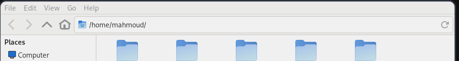
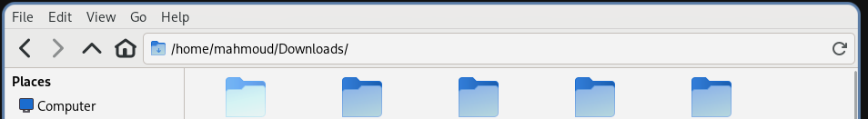
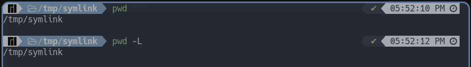
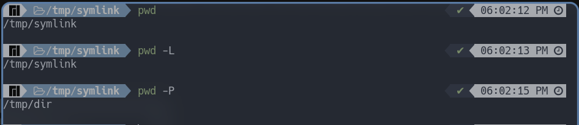

السلام عليكم ورحمه الله وبركاته  

مقال اليوم هو مقال قصير وهو عن احدى اوامر لينكس شائعه الاستخدام وهو امر ```pwd```  

#### قبل التعرف علي الامر يجب علينا ان نجاوب علي سؤال وهو ( ما هو مجلد العمل الحالي ) 
> سواء كنت تستعمل نظام تشغيل ويندوز او لينكس فهذا فإن هذا المفهوم لا يتغير باختلاف نظام التشغيل  

مجلد العمل الحالي هو المجلد الذي يكون المستخدم بداخله في الوقت الحالي 
فعند تشغيل جهاز الحاسوب عاده ما يظهر بعد ادخال كلمه السر ( اذا كانت مطلوبه ) هو سطح المكتب و يعد سطح المكتب مجلد ايضا   
لذلك فان المجلد الحالي الذي تتواجد به هو >>  سطح المكتب واذا قمت بعد ذلك بالذهاب لمجلد معين اسمه ```Downloads``` فسوف يتغير مجلد العمل الحالي من سطح المكتب الي ```Downloads``` ويعد هذا الامر منطقي وبدهي جدا وسهل الفهم  
الامر بكل بساطه انك دائما ما تكون داخل مجلد معين وعندما تدخل لمجلد اخر فان مجلد العمل الحالي سيكون هو نفس المجلد الذي يتواجد به المستخدم

انا استخدم لينكس و عند استخدام مدير الملفات الخاص بي سيظهر مجلد العمل الحالي بهذا الشكل


 
من خلال الصوره يمكن ان نعلم بان مجلد العمل الحالي هو ```/home/mahmoud```

واذا قمت بالدخول لمجلد ```Downloads``` سنلاحظ الاختلاف التالي 

من خلال الصوره يمكن ان نعلم بان مجلد العمل الحالي هو ```/home/mahmoud/Downloads``` 

كل ما سبق من شرح كان شرحا لفكره ( مجلد العمل الحالي )

#### مقدمه عن امر ```pwd```
امر ```pwd``` اختصار ل ```Print Working Directory``` اي طباعه مجلد العمل الحالي بدءاً من مجلد المجذر في لينكس

كما ان امر ```pwd``` يعد من الاوامر المبنيه بداخل الصدفيه نفسها 

لذلك اذا قمت بفتح الطرفيه الان وقمت بكتابه هذا الامر فستجد انك بمجرد فتح الطرفيه انك بطبيعه الامر تكون داخل مجلد عمل حالي


> الفقره القادمه من المقال قد لا تجدها مهمه جدا اذا كنت من الاشخاص الذين لا يتعاملون مع الروابط الرمزيه في لينكس
#### الخيارات المتاحه لامر ```pwd```
لا يوجد سوى خيارين اثنين لامر ```pwd``` و هما ```-L``` و ```-P``` ويجب مراعاه حاله الاحرف

1. خيار ```-L``` او ```--logical```  
يعد هذا الخيار هو الخيار الافتراضي عند تشغيل امر ```pwd```  
يقوم هذا الخيار بجعل الامر يطبع المسار ولا بدون ان يضع في الاعتبار الروابط الرمزيه `` symbolic links ``  

> اذا كنت تريد ان تعرف المزيد عن الروابط الرمزيه يمكنك البحث عنها باستخدام محرك البحث الخاص بك  

وللايضاح  سوف اقوم بانشاء ملفين بعمل التالي

```bash
[x-user@linux]$ mkdir /tmp/dir # قمنا بانشاء ملد يسمي [ dir ]
[x-user@linux]$ ln -s /tmp/dir /tmp/symlink # قمنا بانشاء رابطه رمزيه ناعمه بين هذا المجلد الذي قمنا بانشاءه ومجلد اخر  باسم [ symlink ]
[x-user@linux]$ cd tmp/symlink # قمنا بالانتقال الي المجلد الذي قمنا بربطه مع الخطوه الثانيه
```

والان بعد الانتقال الي هذا المجلد يمكن ان نقوم بتجربه الامر



نلاحظ عدم وجود اختلاف ونتيجه متوقعه لان مجلد العمل الحالي هو [ symlink ] رغم وجود رابطه رمزيه 

2. خيار ```-P```او ```--physical``` 

يقوم هذا الخيار بطباعه مجلد العمل الحقيقي والفعلي لهذا المجلد ويجعل هذا الخيار امر ```pwd``` ياخذ الروابط الرمزيه بعين الاعتبار


يمكننا ملاحظه ان العنوان الفعلي لهذا الملف هو  ```/tmp/dir``` وليس ```/tmp/symlink``` 



والي هنا يكون قد انتهي مقال اليوم املا ان يكون هذا المقال مفيدا لشخص في المستقبل او افاد شخصا في الوقت الحاضر   
وشكرا جزيلا لكل من قراء المقال واتمني ان يكون مقال مفيدا سائلا الله ان ينفعنا بما علمنا  
وانتظر ارائكم واقتراحاتكم عن المقال باذن الله

